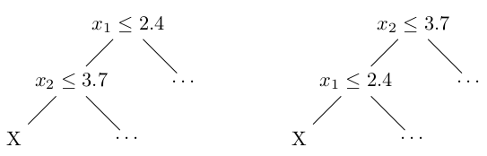

Introduction
============

The problem of learning optimal policy rules that map an individual
covariate profile to a treatment decision has gained significant
traction in recent years. Increasing availability of rich, large-scale
data has contributed to this shift away from static policymaking towards
a data-driven approach [@Amram2022-wt]. For example, in medicine,
treatment decisions are increasingly personalised at the patient level
according to patient characteristics and expected outcomes.

The existing literature on statistical methods for learning optimal
policy rules is vast
[@Manski2004-wf; @Swaminathan2015-qm; @Kitagawa2018-le; @Van_der_Laan2015-ko; @Luedtke2016-at; @Luedtke2016-bi; @Athey2021-uo].
Proposed approaches include those that assign a particular policy action
(or treatment) to individuals whose expected benefit from being assigned
to that treatment compared to a baseline treatment (estimated via the
conditional average treatment effect (CATE) function) is positive, or
those that directly select a policy rule that maximises expected
outcomes across the population. Essentially, policy learning involves
counterfactual estimation since we can only observe outcomes under the
treatment actually received.

In this paper, we consider the problem of learning optimal policy rules
from an observational dataset of individuals $i=1,\ldots,n$, that are
characterised by the form $(X_i,W_i,Y_i)$, where $X_i$ is a vector of
covariates including confounders and effect modifiers, $W_i$ is a
discrete treatment that could take one of $w=1,\ldots,m$ values, and
$Y_i$ is the observed outcome. Our aim is to learn a policy rule $\pi$
that maps $X$ into a treatment decision
$X \rightarrow \pi(x) \in \{1,\dots,m\}$ for policies in a pre-specified
policy class $\pi \in \Pi$. The optimal policy rule $\pi^*$ is the rule
that maximises (or minimises, depending on the objective function) the
estimator of the policy value, often defined as the expected
counterfactual mean reward $\mathbb{E}[\Gamma_{iw}(\pi(X_i))]$, where
$\Gamma_{iw}$ is the estimated counterfactual reward for each
observation $i$ under each policy action $w$.

Depth-$k$ decision trees are a popular class for policy learning
problems since they are able to generate interpretable and transparent
outputs that describe the underlying model behind the policy decision.
Decision trees recursively partition the covariate vector and assign a
treatment decision to the partition that is aligned with a pre-specified
tree depth, also known as the leaf node. The trained tree is then used
to classify observations to a treatment decision by guiding them through
the path of splits and into a leaf node according to their individual
covariate profile. This tree-like structure means that the reasoning
behind the decision rule is explainable, which is an often important
consideration in personalised decision making.

Traditionally, decision trees are trained using a top-down, greedy
approach, meaning that the recursive algorithm starts at the root node
and finds the locally optimal split at each partition, without
considering the impact of future splits on overall tree performance. The
problem with the greedy heuristic, however, is that the resulting tree
may not capture all of the underlying characteristics of the data,
leading to a suboptimal tree. A superior decision tree can be found by
considering all future splits at each partition, thus achieving a
globally optimal solution that maximises the objective function.
Decision tree performance can be measured in terms of scalability
(i.e. maintains performance as the dimensionality of data and tree depth
increases), computational intensity and speed (i.e. generates a solution
in a reasonable timeframe), and accuracy of optimality (i.e. correctly
maximises the policy value estimator).

In recent years, there have been some notable developments in decision
tree-based methods for policy learning that are globally optimal. Some
of these methods embed counterfactual estimation and policy learning
within the same decision tree, while others separate these two tasks by
first estimating the counterfactuals using an appropriate data model,
and then training a decision tree on these estimates to learn the
optimal policy rule [@Amram2022-wt]. We focus on methods that use the
latter approach since we are only interested in the policy optimisation
step in this work. @Zhou_2023 develop an implementation of an exhaustive
tree-search based algorithm that finds an exact optimal tree. However,
their tree struggles to scale well beyond shallow trees and small
datasets. Based on the work of @Bertsimas2017-bs, they also consider
formulating the policy learning problem as a mixed integer programme
(MIP), which can be solved using commercial solvers (e.g. Gurobi
[@gurobi]), however they encounter similar scaling issues using this
approach. @Amram2022-wt develop an alternative implementation of the
exact tree search that uses coordinate descent to train the decision
trees by repeatedly optimising each tree split until no further
improvement in the overall objective function can be achieved.

Our implementation
==================

Our implementation is available as an `R` package called
`fastpolicytree`. Its goal is simply to learn policy trees more quickly
than the existing `policytree` `R` package. We start with an account of
the tree-building approach found in `policytree`.

`policytree` {#sec:pt}
------------

The `tree_search()` function provided by `policytree`, finds an optimal
policy tree (of a given maximal depth) for any given subset of the
covariate and reward data. It does this via a recursive algorithm. Given
any subset of the data and depth limit $d$ as input, `tree_search()`
considers every possible split (each split determined by a choice of
covariate and covariate splitting value) thus creating a 'left' subset
of the data and a 'right' subset. Once an optimal policy tree for both
the left and right subsets have been found (via recursion with depth
limit $d-1$), we then know the best possible reward for the given split.
Since all splits are considered, this allows the algorithm to determine
the optimal policy tree for its input.

A key issue is how these subsets are implemented. In `policytree` each
subset is stored as $p$ sorted sets where $p$ is the number of
covariates. The sorted set for covariate $j$ has (the indices) of the
datapoints in the subset sorted according to their values on covariate
$j$. A major advantage of this approach is that when generating
successive splits for covariate $j$ one can quickly find the datapoints
to move from the 'right' to the 'left'. A disadvantage is that each such
move requires updating $p$ sorted sets.

@Sverdrup2020-yj state that each sorted set is implemented as a binary
search tree which would allow datapoints to be added and removed in time
$O(\log n)$, where $n$ is the size of the set. However, `policytree`
actually implements sorted sets as a sorted vector. The `Boost`
container data type `flat_set` [@flatset] is used, which does allow
faster iteration through the set than using a tree but, addition and
removal are slower. To find where a new element should be inserted into
a flat set takes $O(\log n)$ time, but then it is also necessary to
shift elements to make room for the new element---which takes $O(n)$
time. Examining `policytree` using the Linux `perf` tool we find that it
spends roughly 25%--30% of its time shifting elements. Note that
`policytree` has an important optimisation when looking for depth $d=1$
trees. In this case, there is no need to maintain $p$ sorted sets (since
there will be no further splits) and so a faster method is used.

Discrete optimisation {#sec:do}
---------------------

Before describing how `fastpolicytree` is implemented it will be useful
to explain some general principles of *discrete optimisation*. A
discrete optimisation task is to find the optimal member of some finite
set, so exact policy tree learning is such a task. Typically the set is
very large so simply inspecting each member of the set (*brute-force
search*) is impracticable. Instead methods which exploit the structure
of the problem are used. The recursive approach taken by `policytree`
does exploit the tree structure of policy trees by breaking the problem
down into smaller subproblems which can be solved independently: finding
the trees which are optimal for the subsets on the two side of a split
can be done independently.

A key technique in discrete optimisation is the use of *bounds*. Suppose
that at some point in the search for an optimal policy tree we are about
to find the optimal left and right policy trees for some split. Suppose
also that we have a record of the best policy tree found so far (known
as the *incumbent*). If we have an upper bound on the objective value
(i.e. the reward) of the optimal policy tree for the current split and
this upper bound is *below* the objective value of the incumbent, then
there is no point finding the optimal tree for the current split, since
we know it will not beat the incumbent. The key to the effective use of
bounds is to be able to compute them reasonably quickly and for the
bounds to be reasonably 'tight'---not too far from the (unknown) value
being bounded.

`fastpolicytree` {#sec:fpt}
----------------

To explain `fastpolicytree` it is useful to formalise the policy tree
learning problem and introduce some notation. We are considering the
problem of finding an optimal policy tree for a set of *units*, where a
unit is a collection of covariate values together with a reward for each
possible action. Let $N$ be the set $\{1,\dots,n\}$ of units. Let $A$ be
the set of available actions. Let ${\cal F}_d$ represent the set of
functions $f:N \rightarrow A$ representable by a policy tree of depth
$d$. $f(i)$ assigns an action to unit $i$, so it is an *action
assignment function*. Let $S$ be the set of splits available, each split
$s \in S$ being defined by a choice of covariate $j$ and a value $v$ for
that covariate, so each $s \in S$ is determined by a pair $s=(j,v)$. Let
$x_{ij}$ be the value of covariate $j$ for unit $i$. If a unit $i$ is
such that $x_{ij} \leq v$ then we say the unit is sent left by the split
$s=(j,v)$, otherwise it is sent right.

Let $s_{L}(N)$ (resp. $s_{R}(N)$) be the units sent left (resp. right)
when unit-set $N$ is split using split $s \in S$. Let $r(i,a)$ be the
reward for unit $i$ when it is assigned action $a$. For any action
assignment function $f$ define $R(f,N) := \sum_{i \in N} r(i,f(i))$, so
$R(f,N)$ is the reward when using $f$ to assign actions to all
individuals in $N$. Define
$f^{*}_{d,N} := \arg\max_{f \in {\cal F}_d} R(f,N)$, so $f^{*}_{d,N}$ is
the best function in ${\cal F}_d$ (the best depth $d$ policy tree) to
use to assign actions to all individuals in $N$. Given $d$ and $N$ our
goal is to find $f^{*}_{d,N}$.

Abbreviate $R(f^{*}_{d,N},N)$ to $R^{*}_{d,N}$, so $R^{*}_{d,N}$ is the
best possible reward---the reward resulting from using the best tree
$f^{*}_{d,N}$---for a given $d$ and $N$. We have the basic recursion for
$d>0$
\begin{equation}\label{eq:basicrecursion}
  R^{*}_{d,N}
  = \max_{s \in S}   R^{*}_{d-1,s_{L}(N)} + R^{*}_{d-1,s_{R}(N)}
  \end{equation} The
base case is:
\begin{equation}\label{eq:base}
    R^{*}_{0,N} =  \max_{a \in A} \sum_{i \in N}  r(i,a)
    \end{equation}
\autoref{eq:basicrecursion} and
\autoref{eq:base} lead
to a simple algorithm for finding $f^{*}_{d,N}$: compute
$R^{*}_{d-1,s_{L}(N)} +
R^{*}_{d-1,s_{R}(N)}$ by recursion for each split $s \in S$ and record
which has the highest reward. By recording the maximising split during
the recursive computation we can recover the policy tree which produces
this maximal reward. This is the algorithm used by `policytree`.

### Using bounds {#sec:usingbounds}

Suppose we have found the optimal policy tree $f^{*}_{d,N_{1}}$ for some
set of units $N_{1}$ and depth $d$. Abbreviate $R(f^{*}_{d,N_{1}})$, the
reward for this optimal tree, to $R^{*}_{d,N_{1}}$. Now suppose we add
some new units $N_3$ to $N_1$ such as would happen to a 'left' set if we
increased the splitting value for some covariate. We claim that the
following upper bound on $R^{*}_{d,N_{1}\dot\cup N_{3}}$ is valid.
($\dot\cup$ represents disjoint union.)
\begin{equation}
\label{eq:simpleleft}
  R^{*}_{d,N_{1}\dot\cup N_{3}}  \leq R^{*}_{d,N_{1}} +    \sum_{i \in
  N_{3}} \max_{a \in A} r(i,a)
\end{equation}
The upper bound
\autoref{eq:simpleleft} makes the following (intuitively reasonable)
claim: for units $N_{1}\dot\cup N_{3}$ and tree depth $d$, the best
reward we can hope for is the best reward possible for a depth $d$ tree
for units $N_1$ alone, plus the best possible reward for each unit in
$N_3$. We can prove \autoref{eq:simpleleft} by assuming it false and deriving a
contradiction. $$\begin{aligned}
  R^{*}_{d,N_{1}\dot\cup N_{3}} & > &R^{*}_{d,N_{1}} +    \sum_{i \in
    N_{3}} \max_{a \in A} r(i,a)\\
\Leftrightarrow  R(f^{*}_{d,N_{1}\dot\cup N_{3}},N_{1}) + R(f^{*}_{d,N_{1}\dot\cup N_{3}},N_{3})  & > &R^{*}_{d,N_{1}} +    \sum_{i \in
    N_{3}} \max_{a \in A} r(i,a)\\
\Leftrightarrow  R(f^{*}_{d,N_{1}\dot\cup N_{3}},N_{1}) & > & R^{*}_{d,N_{1}} +    \sum_{i \in
    N_{3}} \left[ \max_{a \in A} r(i,a) - R(f^{*}_{d,N_{1}\dot\cup N_{3}},i)\right]\end{aligned}$$
The last line is a contradiction since each term in
$\sum_{i \in N_{3}} [ \max_{a \in A} r(i,a) - R(f^{*}_{d,N_{1}\dot\cup N_{3}},i)]$
is non-negative and so the inequality asserts that there is a tree
(namely $f^{*}_{d,N_{1}\dot\cup N_{3}}$) which has a strictly higher
reward for $N_1$ than the optimal tree for $N_1$.

Now consider removing some units $N_3$ from a set of units $N_2$ as
would happen to a 'right' set if we increased the splitting value for
some covariate. We claim that the following upper bound
on $R^{*}_{d,N_{2}\setminus N_{3}}$ is
valid.
\begin{equation}\label{eq:simpleright}
    R^{*}_{d,N_{2}\setminus N_{3}} \leq R^{*}_{d,N_{2}} - \sum_{i \in
    N_{3}} \min_{a \in A} r(i,a)
\end{equation}
\autoref{eq:simpleright} makes the following claim: for units
$N_{2}\setminus N_{3}$ (i.e. the set of units in $N_2$ but not $N_3$)
and tree depth $d$, the best reward we can hope for is the best reward
possible for a depth $d$ tree for units $N_2$, minus the lowest possible
reward for each unit in $N_3$. We can prove \autoref{eq:simpleright}
by assuming it false and deriving a
contradiction. $$\begin{aligned}
    R^{*}_{d,N_{2}\setminus N_{3}} & > & R^{*}_{d,N_{2}} - \sum_{i \in
    N_{3}} \min_{a \in A} r(i,a) \\
    \Leftrightarrow  R(f^{*}_{d,N_{2}\setminus N_{3}},N_{2}) - R(f^{*}_{d,N_{2}\setminus N_{3}},N_{3}) & > & R^{*}_{d,N_{2}} - \sum_{i \in
    N_{3}} \min_{a \in A} r(i,a) \\
\Leftrightarrow  R(f^{*}_{d,N_{2}\setminus N_{3}},N_{2}) & > & R^{*}_{d,N_{2}} + \sum_{i \in
    N_{3}} \left[  R(f^{*}_{d,N_{2}\setminus N_{3}},i) - \min_{a \in A} r(i,a)\right]\end{aligned}$$
The last line is a contradiction since each term in $\sum_{i \in
    N_{3}} [  R(f^{*}_{d,N_{2}\setminus N_{3}},i) -  \min_{a \in A} r(i,a)]$
is non-negative and so the inequality asserts that there is a tree
(namely $f^{*}_{d,N_{2}\setminus N_{3}}$) which has a strictly higher
reward for $N_2$ than the optimal tree for $N_2$.

`fastpolicytree` uses the bounds \autoref{eq:simpleleft} and
\autoref{eq:simpleright} as follows. Suppose we are trying to find
$f^{*}_{d,N}$, the optimal policy tree of depth $d$ for a set of units
$N$. Suppose that we have already found $f^{*}_{d-1,N_{1}}$, and
$f^{*}_{d-1,N_{2}}$, where $N = N_{1} \dot\cup N_{2}$ so we have the
optimal reward when $N$ is split into $N_1$ and $N_2$---namely
$R^{*}_{d-1,N_{1}} + R^{*}_{d-1,N_{2}}$. Suppose that later on we are
considering a different split of $N$ where $N_3$ has been removed from
$N_2$ and added to $N_{1}$ (such as is obtained by increasing the
splitting value for some covariate). The optimal reward for this split
is $R^{*}_{d-1,N_{1}\dot\cup N_{3}} +
R^{*}_{d-1,N_{2}\setminus N_{3}}$. From \autoref{eq:simpleleft} and
\autoref{eq:simpleright} we have:
\begin{equation}\label{eq:usingbound}
  R^{*}_{d-1,N_{1}\dot\cup N_{3}} +
R^{*}_{d-1,N_{2}\setminus N_{3}} \leq R^{*}_{d-1,N_{1}} + R^{*}_{d-1,N_{2}} + \sum_{i \in
  N_{3}} \max_{a \in A} r(i,a)   - \min_{a \in A} r(i,a)
  \end{equation}
  So given that
we already have $R^{*}_{d-1,N_{1}} + R^{*}_{d-1,N_{2}}$ the RHS of
\autoref{eq:usingbound} provides a cheaply computable upper bound on
$R^{*}_{d-1,N_{1}\dot\cup N_{3}} + R^{*}_{d-1,N_{2}\setminus N_{3}}$.
`fastpolicytree` computes and stores $\max_{a \in A} r(i,a)$ and
$\min_{a \in A} r(i,a)$ for every unit $i$ before starting the search
for an optimal policy tree, so $\sum_{i \in
  N_{3}} \max_{a \in A} r(i,a)   - \min_{a \in A} r(i,a)$ is quick to
compute. If the current incumbent for set $N$ and depth $d$ has a reward
above this upper bound then `fastpolicytree` does not waste time
computing $R^{*}_{d-1,N_{1}\dot\cup N_{3}} +
R^{*}_{d-1,N_{2}\setminus N_{3}}$ since we know it cannot be an optimal
reward.

### Alternative set implementation {#sec:altset}

`fastpolicytree` implements sets of units in two ways. Method 1 is the
sorted vector (one for each covariate) approach taken by `policytree`,
although this is implemented as a `C` struct rather than using the
`Boost` `C++` library. Method 2 uses a single set rather than a set for
each covariate. Just before iterating over splits for covariate $j$ this
set is sorted according to the values of covariate $j$. An advantage of
this approach is that moving a unit from right to left (as we increase
the splitting value of covariate $j$) is quick and does not require
another $p-1$ sorted sets to be updated. The disadvantage, of course, is
the sorting mentioned above. If the number of distinct values of a
covariate is below a certain threshold (currently 30) then *counting
sort* is used for sorting, otherwise *radix sort* is used. See
@cormen90:_introd_algor for a description of these two sorting
algorithms.

If, when using Method 2, a covariate is found to have only 2 distinct
values in the data (such as would be the case for a binary variable)
then each unit is directly assigned to the left or right set as
appropriate without sorting the set in the normal way.

Method 1 and Method 2 have competing benefits. At present, if most
covariates have no more than 30 distinct values then Method 2 is used,
otherwise Method 1 is used.

### Caching

Consider the two partially constructed policy trees displayed in \autoref{fig:cacheex}. The left-hand tree illustrates the situation
where we are looking for an optimal tree with top-level split
$x_{1} \leq 2.4$ and are looking for an optimal tree with split
$x_{2} \leq 3.7$ for those units satisfying $x_{1} \leq 2.4$. The
right-hand tree is the same except with $x_{2} \leq 3.7$ at the top and
$x_{1} \leq 2.4$ below. It is clear that the set of units $N$ reaching
node X is the same in both cases: those where both $x_{1} \leq 2.4$ and
$x_{2} \leq 3.7$. Since X is at the same depth $d$ in both cases it
follows that the optimal policy tree is the same ($f^{*}_{d,N}$) in both
cases.

For each set of units $N$ and depth $d$, once `fastpolicytree` has found
the optimal policy tree $f^{*}_{d,N}$, it is stored in a cache (unless
the cache has got too big, at present the cache is limited to have at
most 1,000,000 trees). If at a later point the algorithm is required to
find $f^{*}_{d,N}$ again, it is simply retrieved from the cache.

### Miscellaneous optimisations

The previous three sections give the main optimisations found in
`fastpolicytree`: using bounds, allowing for a different implementation
of sets and caching. There are also some other optimisations:

Perfect trees

:   If, while attempting to find the optimal policy tree $f^{*}_{d,N}$
    for some set of units $N$ and depth $d$, we find a tree that assigns
    $\max_{a \in A} r(i,a)$ (i.e. the best action) to each unit
    $i \in N$, then we know we have an optimal tree (since no tree, of
    any depth, can have higher reward) and we can stop searching
    further. We call such trees *perfect*.

Pre-allocating memory

:   During the course of its search for an optimal tree,
    `fastpolicytree` constructs many set of units $N$, many (mostly
    temporary) policy trees and some other temporary arrays of values.
    Allocating memory for such data structures can be expensive, so
    `fastpolicytree` allocates the necessary memory once at the start of
    the search and frees it at the end. So rather than allocating memory
    to store a new tree, pre-allocated space is used and the new tree
    overwrites any tree previously stored in that space.

Simulation study
================

In this section, we perform several experiments on synthetic data to
test the relative performance of our implementation of the optimal
decision tree for policy learning against existing implementations
described in the previous section. Our simulation setup has been
inspired by @Zhou_2023.

In our experimental set up, we generate variations of the following
parameters: the sample size $n$ (500, 1000 and 2000), the dimension $p$
of the covariate vector $X$ (5 and 10), the type of covariate vector
(continuous or discrete), the number of potential treatment values $m$
(2 and 3), and the decision tree depth $d$ (2 and 3). We simulate the
covariate vector $X$ by drawing variables $X_1,\ldots,X_p$ from the
standard normal distribution for continuous covariate data, and from the
Bernoulli(0.5) distribution for discrete covariate data. The treatment
variable $W$ is a categorical variable that can take $m$ values
$(0, \dots, m-1)$, and is generated by randomly sampling from a vector
of two or more elements depending on the value of $m$, corresponding to
a setting of fully randomised treatment without confounding. The outcome
variable is a function of $X$, $W$ and an error term $\epsilon$ drawn
from a uniform distribution on the interval $(0, 1)$, as follows:
$$Y = X_1 + X_{2}I(W \geq 1) + X_{3}I(W=m-1) + \epsilon.$$ This data
generating process illustrates a setting with treatment effect
heterogeneity. The heterogeneous treatment effect comprises two
components: the first is $X_2$ and arises for anyone whose treatment
level exceeds the baseline ($W = 0$); the second, $X_3$, occurs only for
individuals who receive the maximum treatment level, $m-1$. Note that
all covariates $X_i$ with $i \geq 4$ do not influence the outcome. This
models a (realistic) scenario where only a few variables affect the
outcome but the researcher does not know this and needs to set the
policy tree algorithm to consider a large number of covariates. For each
variation of the data generating process (DGP), we perform 10
repetitions.

Our performance measures include the runtime for training the decision
tree (denoted $T$, measured using elapsed CPU time) and the estimator of
the policy value under the learned policy rule
$\mathbb{E}[\Gamma_{iw}(\pi(X_i))]$, which requires estimates of the
reward matrix $\Gamma_{iw}$. For ease of implementation, we estimate
$\Gamma_{iw}$ by following the procedure used by @Athey2021-uo and
@Zhou_2023 from the causal inference and policy evaluation literature,
which generates estimates of heterogeneous treatment effects (via the
CATE function) that can be used (along with estimates of the outcome and
treatment models) to construct $\Gamma_{iw}$, as follows:
$$\Gamma_{iw} = \hat{\mu}_{w}(X_i) + \frac{Y_i-\hat{\mu}_{w}(X_i)}{\hat{e}_{w}(X_i)}\cdot \mathbb{1}\{W_i=w\},$$
where $\hat{\mu}_{w}(X_i)$ is the estimated counterfactual response
surface for each $i$ under each treatment $w$, and $\hat{e}_{w}(X_i)$ is
the estimated probability that $i$ is assigned to treatment $w$. These
parameters are estimated by fitting a causal forest, which is a causal
adaption of the random forest prediction algorithm [@Athey2019-qf].

We compare our implementation of policy trees to those used in
@Zhou_2023 and @Athey2021-uo (i.e. `policytree`[^1] developed by
@Sverdrup2020-yj). Our simulation procedure for each DGP can be
described in the following steps:

1.  For each repetition:

    1.  Generate data according to sample size ($n$), dimension of the
        covariate vector ($p$), data type, number of treatments ($m$)
        and decision tree depth ($d$).

    2.  Fit a causal forest (when $m=2$) or a multi-arm causal forest
        (when $m>2$).

    3.  Compute the rewards matrix $\Gamma_{iw}$.

    4.  For each implementation of the policy tree:

        1.  Train the tree (with $\Gamma_{iw}$ and $X_i$ as inputs) and
            store the runtime $T$.

        2.  Generate predictions of the policy rule $\pi$ for each $i$.

        3.  Estimate and store the policy value
            $\mathbb{E}[\Gamma_{iw}(\pi(X_i))]$.

2.  Take averages of the stored values across repetitions.

Results
=======

Comparison to `policytree` with default parameters
--------------------------------------------------

In this section we compare `policytree` to `fastpolicytree` where
`policytree` has all its parameters set to default values, except tree
depth (where appropriate). When `policytree` is run in this way both it
and `fastpolicytree` find an optimal policy tree for the given depth. We
have checked that the rewards of the trees found by `policytree` and
`fastpolicytree` are identical in all our simulations. It follows that
the time taken to produce an optimal policy tree is the only quantity of
interest. Our timing results are presented in
Table [1](#tab:ptdefault){reference-type="ref"
reference="tab:ptdefault"}

::: {#tab:ptdefault}
  ----------------------------------------------------------- ---- ------ ------- ------------ ------------ ------------ ------------ ------------ -- --
                                                                                                                                                      
                               N                               p    Acts   Depth      Data         Time          SD          Time          SD         
                                                                                                                                                      
                                                                                                                                                      
                               N                               p    Acts   Depth      Data         Time          SD          Time          SD         
                                                                                                                                                      
                                                               10    2       2      discrete    0.029 sec    0.004 sec    0.002 sec    0.001 sec      
                             5000                              10    2       2      discrete    0.492 sec     0.05 sec    0.006 sec    0.001 sec      
                             10000                             10    2       2      discrete    1.922 sec    0.216 sec    0.012 sec    0.002 sec      
                                                               30    2       2      discrete    0.284 sec    0.032 sec    0.008 sec    0.001 sec      
                             5000                              30    2       2      discrete    5.059 sec    0.544 sec     0.03 sec    0.002 sec      
                             10000                             30    2       2      discrete    17.856 sec   1.972 sec     0.06 sec    0.007 sec      
                                                               60    2       2      discrete    1.393 sec    0.147 sec    0.025 sec    0.002 sec      
                             5000                              60    2       2      discrete    20.902 sec    2.3 sec     0.107 sec    0.005 sec      
                             10000                             60    2       2      discrete    1.352 min    18.981 sec    0.21 sec    0.018 sec      
                                                               10    3       2      discrete    0.031 sec    0.003 sec    0.004 sec    0.001 sec      
                             5000                              10    3       2      discrete    0.494 sec    0.054 sec    0.008 sec    0.001 sec      
                             10000                             10    3       2      discrete    1.928 sec    0.201 sec    0.013 sec    0.002 sec      
                                                               30    3       2      discrete    0.289 sec     0.03 sec    0.011 sec    0.001 sec      
                             5000                              30    3       2      discrete    5.057 sec    0.549 sec    0.037 sec    0.003 sec      
                             10000                             30    3       2      discrete    17.738 sec   1.963 sec    0.068 sec    0.004 sec      
                                                               60    3       2      discrete     1.4 sec     0.143 sec    0.026 sec    0.002 sec      
                             5000                              60    3       2      discrete    21.241 sec   2.507 sec    0.122 sec    0.009 sec      
                             10000                             60    3       2      discrete    1.347 min    12.578 sec   0.248 sec    0.023 sec      
                                                               10    10      2      discrete    0.034 sec    0.003 sec    0.006 sec    0.002 sec      
                             5000                              10    10      2      discrete    0.508 sec    0.058 sec    0.011 sec    0.001 sec      
                             10000                             10    10      2      discrete    1.955 sec    0.197 sec    0.019 sec    0.002 sec      
                                                               30    10      2      discrete    0.296 sec    0.032 sec    0.011 sec    0.001 sec      
                             5000                              30    10      2      discrete    5.214 sec    0.533 sec    0.051 sec    0.003 sec      
                             10000                             30    10      2      discrete    18.184 sec   1.783 sec    0.111 sec    0.008 sec      
                                                               60    10      2      discrete    1.444 sec    0.132 sec    0.034 sec    0.003 sec      
                             5000                              60    10      2      discrete    21.536 sec   2.601 sec     0.19 sec    0.024 sec      
                             10000                             60    10      2      discrete    1.306 min     9.18 sec     0.42 sec    0.028 sec      
                                                               10    2       3      discrete    0.214 sec    0.019 sec    0.005 sec    0.001 sec      
                             5000                              10    2       3      discrete    2.966 sec    0.292 sec    0.012 sec    0.001 sec      
                             10000                             10    2       3      discrete    11.701 sec   1.192 sec    0.023 sec    0.003 sec      
                                                               30    2       3      discrete    5.909 sec    0.584 sec    0.064 sec    0.004 sec      
                             5000                              30    2       3      discrete    1.609 min    10.264 sec   0.298 sec    0.012 sec      
                             10000                             30    2       3      discrete    5.477 min    37.104 sec   0.589 sec    0.024 sec      
                                                               60    2       3      discrete    55.554 sec    5.74 sec    0.526 sec    0.022 sec      
                             5000                              60    2       3      discrete    13.394 min   1.575 min     2.62 sec    0.102 sec      
                             10000                             60    2       3      discrete    45.177 min   4.963 min    5.245 sec    0.208 sec      
                                                               10    3       3      discrete     0.22 sec    0.019 sec    0.007 sec    0.001 sec      
                             5000                              10    3       3      discrete    3.006 sec    0.269 sec    0.016 sec    0.002 sec      
                             10000                             10    3       3      discrete    11.717 sec   1.149 sec    0.029 sec    0.011 sec      
                                                               30    3       3      discrete    5.995 sec    0.555 sec    0.079 sec    0.004 sec      
                             5000                              30    3       3      discrete    1.631 min    9.892 sec    0.381 sec    0.021 sec      
                             10000                             30    3       3      discrete    5.547 min    36.543 sec   0.749 sec    0.029 sec      
                                                               60    3       3      discrete    56.37 sec    5.376 sec    0.631 sec    0.028 sec      
                             5000                              60    3       3      discrete    13.827 min   1.555 min    3.203 sec     0.13 sec      
                             10000                             60    3       3      discrete    47.167 min   5.623 min    6.437 sec    0.261 sec      
                                                               10    10      3      discrete    0.228 sec     0.02 sec    0.007 sec    0.002 sec      
                             5000                              10    10      3      discrete    3.067 sec    0.286 sec    0.024 sec    0.002 sec      
                             10000                             10    10      3      discrete    12.01 sec    1.108 sec    0.053 sec    0.006 sec      
                                                               30    10      3      discrete    6.261 sec    0.573 sec    0.111 sec    0.007 sec      
                             5000                              30    10      3      discrete    1.677 min    10.335 sec   0.616 sec    0.035 sec      
                             10000                             30    10      3      discrete    5.699 min    36.839 sec    1.34 sec    0.072 sec      
                                                               60    10      3      discrete    58.936 sec   5.552 sec    0.908 sec    0.055 sec      
                             5000                              60    10      3      discrete    14.169 min   1.637 min    5.158 sec    0.259 sec      
                             10000                             60    10      3      discrete    47.047 min   5.323 min    11.44 sec    0.735 sec      
                                                                                                                                                      
                              500                              5     2       2     continuous   0.044 sec    0.004 sec     0.02 sec    0.003 sec      
                             1000                              5     2       2     continuous   0.167 sec    0.014 sec    0.057 sec    0.009 sec      
                             2000                              5     2       2     continuous   0.659 sec    0.062 sec    0.181 sec     0.03 sec      
                                                               10    2       2     continuous   0.172 sec    0.015 sec    0.046 sec    0.006 sec      
                             1000                              10    2       2     continuous   0.669 sec    0.058 sec    0.131 sec    0.019 sec      
                             2000                              10    2       2     continuous   2.735 sec    0.264 sec    0.407 sec     0.06 sec      
                                                               5     3       2     continuous   0.057 sec    0.005 sec    0.032 sec    0.006 sec      
                             1000                              5     3       2     continuous   0.216 sec    0.019 sec    0.092 sec    0.019 sec      
                             2000                              5     3       2     continuous   0.858 sec    0.077 sec    0.274 sec    0.067 sec      
                                                               10    3       2     continuous    0.22 sec    0.019 sec    0.089 sec    0.018 sec      
                             1000                              10    3       2     continuous   0.865 sec    0.078 sec    0.259 sec    0.061 sec      
                             2000                              10    3       2     continuous   3.531 sec    0.327 sec    0.702 sec    0.172 sec      
                                                               5     2       3     continuous   1.211 min    6.121 sec    7.722 sec    1.568 sec      
                             1000                              5     2       3     continuous   9.323 min    46.243 sec   37.939 sec   7.006 sec      
                             2000                              5     2       3     continuous   1.215 hrs    5.996 min     3.74 min    42.475 sec     
                                                               10    2       3     continuous    9.55 min    47.916 sec   34.004 sec   6.382 sec      
                             1000                              10    2       3     continuous   1.246 hrs    6.225 min    2.322 min    27.031 sec     
                             2000                              10    2       3     continuous   9.975 hrs    43.205 min   10.799 min   1.744 min      
                                                               5     3       3     continuous   1.497 min    15.679 sec   15.831 sec   3.593 sec      
                             1000                              5     3       3     continuous   11.649 min    1.5 min     1.672 min    26.951 sec     
                             2000                              5     3       3     continuous    1.52 hrs    8.305 min    9.865 min    2.841 min      
                                                               10    3       3     continuous   11.704 min   54.765 sec   1.294 min    20.11 sec      
                             1000                              10    3       3     continuous   1.526 hrs    7.184 min     7.6 min       2 min        
                             2000                              10    3       3     continuous   12.376 hrs   53.47 min    37.925 min   10.356 min     
   [\[tab:ptdefault\]]{#tab:ptdefault label="tab:ptdefault"}                                                                                          
  ----------------------------------------------------------- ---- ------ ------- ------------ ------------ ------------ ------------ ------------ -- --

  : Simulation results *(continued)*
:::

In all cases `fastpolicytree` performs orders of magnitudes more
quickly, with the difference becoming more pronounced for deeper trees.
The difference in performance is particularly large when using discrete
covariates. For example for the
$(N=10000,p=60,\mathrm{Acts}=2,\mathrm{Depth}=3)$ configuration on
discrete covariates, `policytree` takes 45.177 minutes (on average)
whereas `fastpolicytree` takes 5.245 seconds. This is a 517% speed-up.

The `fastpolicytree` performance improvement on continuous data is less
dramatic, but still good. For example, a depth-three tree learned from
10 continuous covariates where N=2000 with 3 treatment actions takes
over 12 hours using the `policytree` package. With `fastpolicytree`, the
time reduces to 37.9 minutes, roughly 20 times faster.[^2]

Using split steps
-----------------

We now turn to a comparison between our `fastpolicytree` and a proposed
technique to reduce the runtime of the original `policytree` package.
Increasing the optional approximation parameter, `split.step`, decreases
the number of possible splits to consider during the tree search. The
authors of `policytree` demonstrate that increasing this parameter for
learning trees with continuous covariates can greatly improve the
runtime compared to the default `split.step` value of 1. However, less
is known about the potential loss in accuracy of the estimated policy
rewards due to bias in the learned trees occurring when samples are
skipped (i.e., trees are no longer guaranteed *optimal*). As in the
first simulation study, we compare the runtimes of the two packages,
however for the `policytree` package we set the `split.step` parameter
equal to 10. We report the runtimes and also the root mean squared error
(RMSE) between the `fastpolicytree` and `policytree` estimated policy
values, i.e.:
$$RMSE = \sqrt{\frac{1}{nsim}\sum(\mathbb{E}[\Gamma_{iw}(\pi_{FPT}(X_i))] - \mathbb{E}[\Gamma_{iw}(\pi_{PT}(X_i))])^2}$$

  -------- ---- ------ ---------- ------------ ------------ ------------ ------------ ------------ -------
                        **RMSE**                                                                   
  N         p    Acts    Depth        Time          SD          Time          SD                   
  1000      30    3        2       continuous   0.818 sec    0.079 sec    0.625 sec    0.056 sec    0.004
  10000     30    3        2       continuous   1.501 min    17.502 sec   45.787 sec   12.218 sec   0.000
  100000    30    3        2       continuous   7.871 hrs    2.285 hrs    2.135 hrs    31.591 min   0.000
  1000      30    20       2       continuous   2.549 sec    0.243 sec    2.638 sec    0.311 sec    0.009
  10000     30    20       2       continuous   5.805 min    55.805 sec   2.321 min    25.09 sec    0.000
  100000    30    20       2       continuous   41.501 hrs   7.777 hrs    9.358 hrs    2.546 hrs    0.000
  -------- ---- ------ ---------- ------------ ------------ ------------ ------------ ------------ -------

  : Simulation results: splitstep `policytree` (Continuous covariate
  data)

*Note:* Results are averaged across 100 repetitions. The splitting step
is set to 10 for all Athey `policytree` versions. Reward RMSE is
calculted as the square root of the mean squared difference between FPT
and `policytree` rewards.

Even with the `split.step` parameter increased, the `fastpolicytree`
runtimes are an improvement over the original package version in larger
samples. For $N=100,000$ with 30 continuous covariates and 20 actions, a
depth two tree learned using `fastpolicytree` is roughly three times
faster. For smaller samples the runtimes are similar, but there is a
loss in accuracy between the two versions, indicating that using
`fastpolicytree` may be preferable when accuracy in the predicted reward
is desirable. We depict this graphically in Figure
[1](#fig:splitstep_errors){reference-type="ref"
reference="fig:splitstep_errors"}, which shows the distribution of
absolute errors between `fastpolicytree` and `policytree` with
`split.step` parameter increased.

{#fig:splitstep_errors
width="\\linewidth"} [\[fig:splitstep\_errors\]]{#fig:splitstep_errors
label="fig:splitstep_errors"} *Note:* Results are across 100 repetitions
of the continuous simulations. The splitting step is set to 10 for all
Athey `policytree` versions. Absolute error is calculated as difference
between FPT and `policytree` rewards.

Conclusion and Future Work
==========================

In this paper, we describe an algorithm, `fastpolicytree`, for learning
optimal policy trees that exploits a number of optimisations to improve
run times significantly when compared to `policytree`. We have performed
a large number of benchmarking experiments to support the claim of
improved running time. With this faster algorithm it is possible to
learn optimal policy trees of greater depth, thus helping practitioners
find better policies by accounting for more individual characteristics
in the treatment allocation procedure.

The methods employed by `fastpolicytree` (the use of bounds, caching,
etc) are standard ones in discrete optimisation although they have been
specialised for the particular problem at hand. As well as algorithmic
improvements, our implementation work also makes a difference according
to covariate type. Discrete covariates can take advantage of our
'Method 2' set implementation (see
Section [2.3.2](#sec:altset){reference-type="ref"
reference="sec:altset"}) which explains the particular good runtimes we
have for them.

Discrete optimisation is a well-developed and active area of research
and we expect further effort in applying its methods to policy tree
learning to bear fruit. Indeed, there is considerable work specifically
on learning 'optimal trees'. In many cases the optimal trees being
learned are classification or regression trees rather than policy trees
but there is considerable commonality between these tasks.
@NEURIPS2023_1d5fce96 provide a good summary of recent work in this area
and describe STreeD (Separable Trees with Dynamic programming), a method
which has good results for both (cost-sensitive) classification trees
and policy trees.

The `fastpolicytree` `R` package is available on CRAN at:
<https://cran.r-project.org/package=fastpolicytree>. The code is written
in `C` with some 'wrapper' code written in `R`. It is also possible to
create a standalone Linux executable (if one has a `C` compiler
installed). The `R` package contains a single function:
`fastpolicytree()`, which is intended as a direct replacement for the
`policy_tree()` function provided by the `policytree` `R` package. The
`fastpolicytree()` function has additional arguments which can be used
to alter its standard approach to finding optimal policy trees, but a
user can safely leave these at their default values. The
`fastpolicytree()` function lacks the `split.step` argument that the
`policy_tree()` function has, since we focus on finding only optimal
trees (for a given depth). The `policytree` `R` package has many useful
functions in addition to `policy_tree()`. We have not replicated these
in the `fastpolicytree` package, so in practice it makes sense to have
both packages available.

Acknowledgments {#acknowledgments .unnumbered}
===============

This research was funded by the UK Medical Research Council (MRC) as
part of Project MR/T04487X/1: *Tailoring Health Policies To Improve
Outcomes Using Machine Learning, Causal Inference And Operations
Research Methods*.

[^1]: <https://github.com/grf-labs/policytree>

[^2]: The learned policy $\pi$ and the estimated policy values
    $\mathbb{E}[\Gamma_{iw}(\pi(X_i))]$ are identical for both versions
    and are not reported here.
